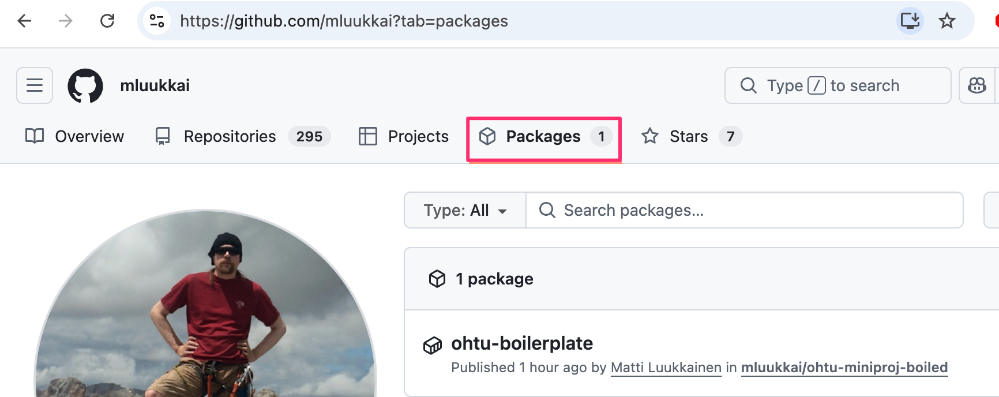

## Ohtu miniprojekti boilerplate

Lue [täältä](https://ohjelmistotuotanto-hy.github.io/flask/) lisää.

Muutamia vihjeitä projektin alkuun [täällä](https://github.com/ohjelmistotuotanto-hy/miniprojekti-boilerplate/blob/main/misc/ohjeita.md).

### Sovelluksen vieminen OKD-klusterille

Oletuksena on, että

- olet jo kirjautunut `oc`-komentorivityökalulla oikeaan OKD-klusteriin ja oikeaan projektiin (`oc project <namespace>`).
- projekti on pushattu onnistuneesti GitHubiin ja siitä on muodostunut Docker-kuva, joka on julkinen. Varmista tämä GitHubista, repositorion Packages-välilehdeltä (Package settings → Change visibility → Public):



Ennen ensimmäistä klusterillevientiä eli deployausta muokkaa tiedostoon `kustomization.yaml` seuraavat kohdat omaan projektiin sopiviksi:

- `namespace` — OKD-projekti, johon sovellus deployataan.
- `images.newName` — oman Docker-imagen osoite, johon GitHub Actions -workflow pushaa buildatun imagen. GitHub action luo repositorin nimen automaattisesti, joten osoite on muotoa `ghcr.io/<käyttäjätunnus>/<repo-nimi>`.
- `patches`-kohdan Route-patchin `value` — sovelluksen julkinen osoite. Tämän tulee olla uniikki koko klusterilla, ja muotoa `route-<projekti>.ext.okd-cs-test-0.k8s.cs.helsinki.fi`.

Ensimmäisellä kerralla luo salaisuustiedosto kopioimalla malli ja täyttämällä oikea arvo:

```sh
cp secret.env.template secret.env
```

Muokkaa tiedostoon `secret.env` oikea `SECRET_KEY`-arvo. Tiedostoa ei lisätä versionhallintaan.

Sovellus deployataan (tai päivitetään) klusterille [Kustomize](https://kustomize.io/)n avulla komennolla:

```sh
oc apply -k .
```

Komento luo/päivittää kaikki `kustomization.yaml`-tiedostossa määritellyt resurssit kubernetes-resurssit OKD-klusterille.

Jos kaikki menee hyvin, käynnistyy sovellus osoitteeseen http://route-<projekti>.ext.okd-cs-test-0.k8s.cs.helsinki.fi`
